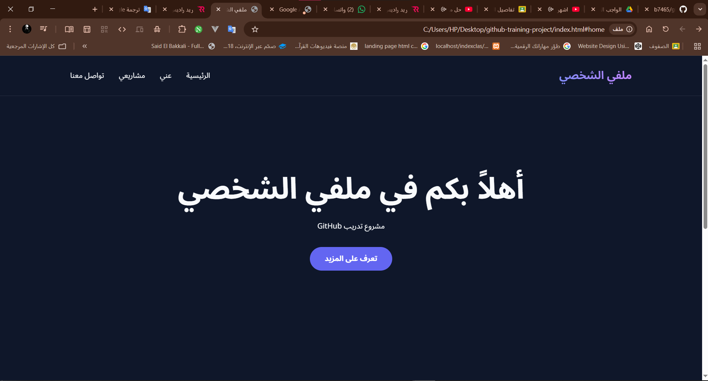
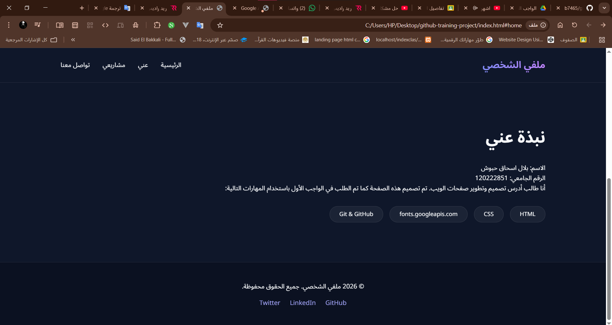

# GitHub Training Project

## Project Description
A simple responsive portfolio website built to practice HTML, CSS, and Git/GitHub workflow, including deployment using GitHub Pages.

## Technologies Used
- HTML
- CSS
- Git
- GitHub

## Screenshots
Homepage Section

About Section

🔗 Live Demo: https://b7465.github.io/github-training-project/

## How to Run
Open index.html in browser

## Student Name
Bilal Ishaq Haboush